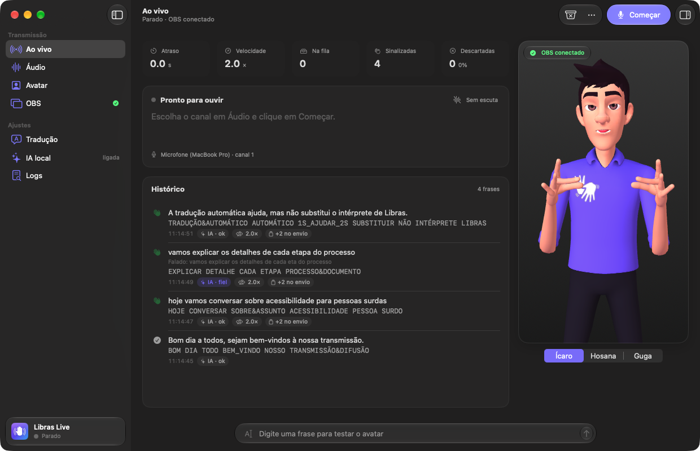
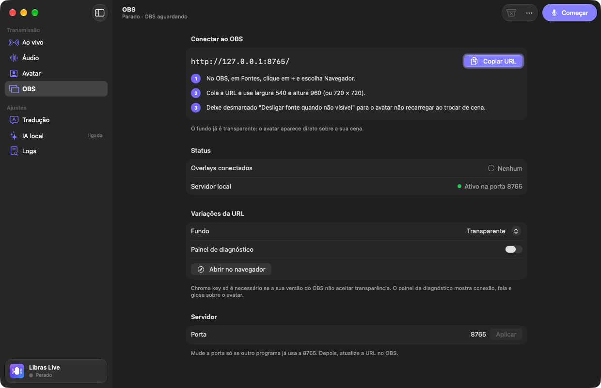
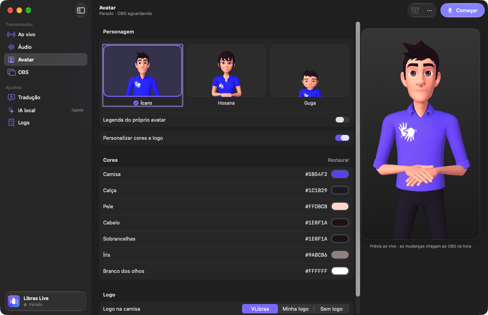
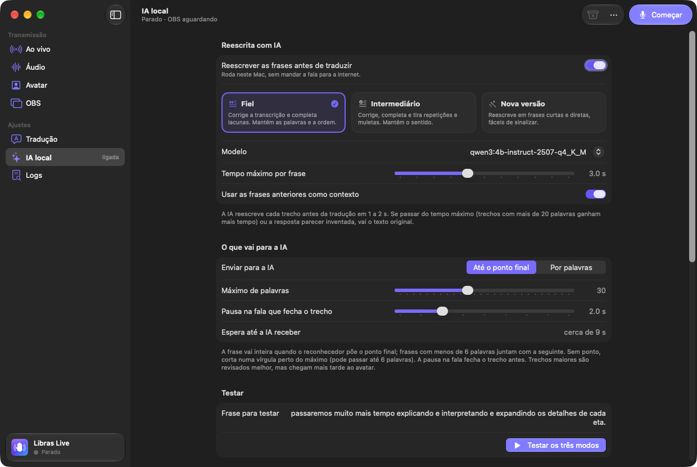

# Libras Live

[](https://github.com/arnaldobatista/libras-live/actions/workflows/verificar.yml)
[](LICENSE)


App para macOS que ouve o áudio da sua transmissão, transcreve a fala em português e põe um avatar 3D **sinalizando em Libras** no OBS, ao vivo.

*In English: a native macOS app that listens to a live stream's audio, transcribes Brazilian Portuguese speech on-device and shows a 3D avatar signing it in Libras (Brazilian Sign Language) as an OBS browser source, using the open-source VLibras player. The docs are in Portuguese; issues and pull requests in English are welcome.*

> **A tradução automática não substitui intérprete de Libras.** Ela ajuda quando não há intérprete, mas erra, principalmente com nomes próprios e termos técnicos. Avise o público que a tradução é automática.



O avatar e a tradução para glosa vêm do [VLibras](https://vlibras.gov.br), a suíte pública de tradução para Libras. O Libras Live junta as peças que faltam para usar isso numa live: captura do canal certo da mesa de som, reconhecimento de fala no próprio Mac, uma fila que mantém o avatar acompanhando a fala e uma página com fundo transparente para o OBS.

O Libras Live é um projeto independente, sem vínculo com o VLibras, o LAVID/UFPB ou o Governo Federal.

## Recursos

- **Qualquer entrada de áudio do Mac, por canal.** Escolha o dispositivo e os canais que têm a voz (vários canais são somados em mono). Funciona com mesas multicanal, como a Soundcraft Ui24, e mostra o nível de cada canal para achar onde está a voz.
- **Reconhecimento de fala no próprio Mac**, com o `SpeechAnalyzer` do macOS 26. O áudio não sai do computador.
- **Frases sem palavra cortada.** O app decide quando a fala vira frase pela pontuação, pelas palavras que já não mudam e pelo silêncio no áudio.
- **Glosa e sinais do VLibras**, com cache local da tradução e das animações.
- **Fila que acompanha a fala.** Junta as frases prontas num envio só, acelera o avatar quando atrasa e, se precisar, descarta primeiro as repetições e depois as frases mais antigas.
- **Avatar no OBS com fundo transparente**, como fonte de navegador. Três personagens: Ícaro, Hosana e Guga.
- **Cores e logo do avatar**, com prévia ao vivo.
- **Reescrita com IA local** (opcional). Um modelo de linguagem rodando no Mac corrige a transcrição antes da tradução, em três níveis: fiel, intermediário ou nova versão. O [Ollama](https://ollama.com) vem dentro do app.
- **Histórico e inspetor:** cada frase com a glosa, o que foi sinalizado, a velocidade e o que a IA mudou.
- **Logs de sessão** com resumo, para entender o que aconteceu numa live.
- **API local** para Stream Deck e automações.
- Interface no padrão do macOS 26, que se adapta ao tamanho da janela, com atalhos de teclado e ícone na barra de menus.

## Como funciona

```
 mesa ou microfone                    seu Mac                      serviços do VLibras
┌────────────────┐   ┌──────────────────────────────────────┐   ┌──────────────────────┐
│ canal de voz   │──►│ captura ─► fala→texto ─► frases      │   │                      │
└────────────────┘   │                            │         │   │                      │
                     │                [IA local, opcional]  │   │                      │
                     │                            ▼         │   │                      │
                     │                          glosa ◄─────┼───┤ tradução             │
                     │                            ▼         │   │                      │
                     │   servidor local ◄────── fila        │   │                      │
                     │       ▲                              │   │                      │
                     │       └──────────────────────────────┼───┤ dicionário de sinais │
                     └───────┬──────────────────────────────┘   └──────────────────────┘
                             ▼
           OBS: fonte de navegador com o avatar
```

O app roda um servidor que só atende o próprio Mac (`127.0.0.1:8765`). O OBS abre a página do avatar nesse endereço, e o app manda cada glosa por uma conexão WebSocket. Os detalhes de cada etapa estão em [docs/arquitetura.md](docs/arquitetura.md).

## Requisitos

- Mac com Apple Silicon e macOS 26 ou mais novo
- [OBS Studio](https://obsproject.com), ou outro programa que aceite fonte de navegador
- Internet: a tradução para glosa e as animações dos sinais vêm do VLibras
- Para a reescrita com IA: uns 3 GB livres para o modelo e, de preferência, 16 GB de memória
- Para compilar: Xcode 26 ou mais novo

## Instalação

### Baixar o app pronto

Cada versão publicada traz o app em [Releases](https://github.com/arnaldobatista/libras-live/releases).

1. Baixe o `Libras-Live-<versão>.zip`, abra e arraste o **Libras Live** para **Aplicativos**.
2. Na primeira abertura, o macOS avisa que não conseguiu verificar o app. Isso acontece porque ele não tem a assinatura paga da Apple, igual a quando você compila.
3. Em **Ajustes do Sistema › Privacidade e Segurança**, role até o aviso do Libras Live e clique em **Abrir Mesmo Assim**.

Se preferir pelo Terminal, este comando faz o mesmo:

```bash
xattr -dr com.apple.quarantine "/Applications/Libras Live.app"
```

### Compilar

```bash
git clone https://github.com/arnaldobatista/libras-live.git
```

```bash
cd libras-live && make run
```

O `make run`:

1. baixa o player do VLibras numa versão fixada;
2. baixa o Ollama numa versão fixada e confere o SHA-256;
3. compila em modo release;
4. monta `build/Libras Live.app` e abre o app.

Para instalar em Aplicativos:

```bash
ditto "build/Libras Live.app" "/Applications/Libras Live.app"
```

## Primeiros passos

Na primeira abertura, as boas-vindas pedem a permissão do microfone, ajudam a escolher o áudio e mostram a URL para o OBS.

1. **Áudio:** escolha o dispositivo e clique nos canais que têm a voz. Ajuste o **ganho** até o medidor ficar entre -30 e -10 dB quando alguém fala.
2. **OBS:** adicione a fonte de navegador (veja abaixo).
3. Clique em **Começar** (⌘L). A tela **Ao vivo** mostra a fala reconhecida, a glosa de cada frase e o avatar.

Para testar sem microfone, digite uma frase no campo embaixo da tela **Ao vivo**.

Na primeira vez que você começa a ouvir, o macOS baixa o modelo de reconhecimento de fala em português. Só nessa vez é preciso esperar um pouco.

## No OBS



1. Em **Fontes**, clique em **+** e escolha **Navegador**.
2. URL: `http://127.0.0.1:8765/`
3. Largura × altura: `540 × 960` (vertical) ou `720 × 720`.
4. Deixe desmarcado **Desligar fonte quando não visível**, para o avatar não recarregar ao trocar de cena.

O fundo já é transparente. Parâmetros opcionais na URL:

| Parâmetro | Exemplo | Efeito |
|---|---|---|
| `bg` | `bg=00ff00` | Cor de fundo (para chroma key) |
| `avatar` | `avatar=hosana` | `icaro`, `hosana` ou `guga` |
| `subtitles` | `subtitles=1` | Legenda do próprio avatar |
| `debug` | `debug=1` | Painel com conexão, fala e glosa |

Dá para ter mais de um overlay aberto, por exemplo em duas cenas. A fila só avança quando todos os overlays **visíveis** terminam. Abas em segundo plano rodam a ~0 fps e são ignoradas.

## Telas

| Tela | O que tem |
|---|---|
| **Ao vivo** | Atraso, velocidade, fila, frases sinalizadas e descartadas; a fala reconhecida; o histórico com a glosa de cada frase; a prévia do avatar e a troca rápida de personagem. |
| **Áudio** | Dispositivo, canais, nível de cada canal, ganho e detector de voz. |
| **Avatar** | Personagem, legenda do próprio avatar, cores e logo. |
| **OBS** | URL para copiar, passo a passo, overlays conectados, fundo para chroma key, painel de diagnóstico e porta. |
| **Tradução** | Velocidade do avatar, fila (juntar frases e descartes), ajustes da glosa e do reconhecimento de fala, dicionário. |
| **IA local** | Reescrita com IA: modo, modelo, o que vai para a IA, teste nos três modos, modelos recomendados e gerenciamento dos modelos. |
| **Logs** | Sessão atual com resumo, sessões anteriores, salvar e apagar. |

Atalhos: **⌘L** começar ou parar, **⌘K** limpar a fila, **⌘T** testar uma frase, **⌥⌘C** copiar a URL do overlay, **⇧⌘S** salvar o log, **⌘1** a **⌘7** trocar de tela e **⌘,** ajustes.

O ícone na barra de menus também começa e para, e mostra o atraso e a fila.

## Aparência do avatar



Na tela **Avatar**, ligue **Personalizar cores e logo**:

- **Cores:** camisa, calça, pele, cabelo, sobrancelhas, íris e branco dos olhos.
- **Logo:** a do VLibras, a sua ou nenhuma. Use PNG com fundo transparente; o app encaixa a imagem no quadro que o avatar usa.
- **Posição da logo:** peito, centro ou os dois, com tamanho e deslocamento.

As mudanças chegam ao OBS na hora. Desligar a personalização recarrega o player por alguns segundos.

> A [personalização oficial do VLibras](https://vlibras.gov.br/doc/widget/functionalities/customize-avatar.html) é oferecida a instituições parceiras. Aqui ela roda localmente, pelo método `ApplyJSON` do próprio player (LGPL). **Confirme com a equipe do VLibras antes de usar a sua logo numa transmissão pública.**

## Reescrita com IA local

Opcional e desligada por padrão. Um modelo de linguagem rodando no Mac revisa a fala antes da tradução, para a frase chegar mais clara ao avatar. Nada sai do computador: o Ollama vem dentro do app, numa porta própria, e não usa os modelos nem a porta de um Ollama que você já tenha instalado.



| Modo | O que faz | Exemplo (fala reconhecida → enviado ao tradutor) |
|---|---|---|
| **Fiel** | Corrige erros de transcrição, pontuação e concordância e completa lacunas óbvias. Mantém as palavras e a ordem. | "os detalhes de cada eta" → "os detalhes de cada etapa" |
| **Intermediário** | Também tira repetições, hesitações e muletas. Mantém o sentido. | "é uma palavra é uma parábola que…" → "é uma palavra, é uma parábola que…" |
| **Nova versão** | Reescreve em frases curtas e diretas, fáceis de sinalizar. | "passaremos muito mais tempo explicando e interpretando…" → "Vamos passar mais tempo explicando, interpretando e detalhando cada etapa." |

Como funciona na transmissão:

- O reconhecedor confirma a fala em pedaços de poucas palavras, e revisar cada pedaço sozinho quase não muda nada. Por isso a IA recebe a frase inteira, **até o ponto final**, ou um número de **palavras** que você escolhe. Uma pausa na fala fecha o trecho antes.
- Trecho maior é revisado melhor, mas chega mais tarde ao avatar. A tela mostra a espera estimada.
- Cada trecho tem um **tempo máximo**. Se a IA passar dele, ou se a resposta parecer inventada, vai o texto original. A tradução nunca fica esperando a IA.
- O histórico marca o que a IA mudou e mostra o que foi falado.

Modelos recomendados, medidos reescrevendo frases reais de transmissões num MacBook Pro M1 Pro com 16 GB:

| Modelo | Download | Memória | Por frase | Resultado |
|---|---|---|---|---|
| `qwen3:4b-instruct-2507-q4_K_M` (recomendado) | 2,5 GB | 2,9 GB | ~1 s | Português natural, corrige sem inventar |
| `gemma4:e2b-it-qat` | 4,3 GB | 3,6 GB | ~0,8 s | Mais rápido; ótimo na nova versão, mas no modo fiel às vezes corta palavras |
| `qwen3.5:4b` | 3,4 GB | 3,1 GB | ~1,6 s | Corrige mais erros do reconhecedor, porém é mais lento |

A tela **IA local** baixa os recomendados com um clique, busca outros modelos em ollama.com, carrega, tira da memória e exclui. As medições completas estão em [docs/medicoes.md](docs/medicoes.md).

## Logs

A tela **Logs** grava cada sessão em `~/Library/Application Support/LibrasLive/logs/`: fala reconhecida, glosa, envios ao avatar, descartes com o motivo, reescritas da IA e tempos. **Salvar log…** (⇧⌘S) gera um `.txt` legível, com resumo e linha do tempo, e um `.jsonl` com os dados completos.

O log contém a fala transcrita. Revise antes de compartilhar.

## API local

Para Stream Deck, automações e testes. Só aceita chamadas do próprio Mac.

```bash
curl -X POST http://127.0.0.1:8765/api/say -H 'Content-Type: application/json' -d '{"text":"Bom dia a todos"}'
```

```bash
curl -X POST http://127.0.0.1:8765/api/clear -H 'Content-Type: application/json'
```

```bash
curl http://127.0.0.1:8765/api/status
```

`POST /api/appearance` muda cores e logo. Os campos estão em [docs/arquitetura.md](docs/arquitetura.md#api-local).

## Dicas para a mesa de som

- Mande para o Mac um canal ou auxiliar **só de voz**, sem música nem retorno. Isso é o que mais melhora o reconhecimento.
- O OBS e o Libras Live podem ler o mesmo dispositivo ao mesmo tempo.
- Na tela **Áudio**, ligue **Mostrar nível de cada canal** enquanto alguém fala para achar o canal da voz.

## Solução de problemas

- **O avatar não aparece no OBS.** Confira se a URL da fonte é a mesma da tela **OBS**: a porta muda se você trocar no app. A tela **OBS** mostra se há overlay conectado. Com `?debug=1` no fim da URL, a página mostra a conexão e o estado do player.
- **"Sem permissão de microfone".** Libere o Libras Live em **Ajustes do Sistema › Privacidade e Segurança › Microfone** e clique em **Começar** de novo.
- **Erro "Servidor do overlay" ao abrir.** Outro programa, ou outra cópia do Libras Live, está usando a porta 8765. Feche a outra cópia ou troque a porta em **OBS › Servidor** e atualize a URL no OBS.
- **O avatar atrasa ou descarta frases.** Sinalizar leva mais tempo que falar. Mande um canal só de voz e ajuste a velocidade em **Tradução**. O resumo do log mostra quanto foi descartado e por quê.
- **A IA deixa o texto original.** O histórico mostra o motivo. Se for "passou do tempo máximo", aumente o tempo em **IA local** ou use um modelo mais rápido. Logo depois de instalar uma versão nova, o motor pode levar uns 30 s para iniciar na primeira vez, enquanto o macOS confere os executáveis.

## Privacidade

- O **áudio** não sai do Mac. O reconhecimento de fala roda no computador.
- O **texto reconhecido** vai para a API de tradução do VLibras (`traducao2.vlibras.gov.br`), e as **animações dos sinais** vêm do dicionário do VLibras. As duas coisas ficam em cache no Mac.
- A **IA local** roda no Mac. O app só fala com o ollama.com quando você busca ou baixa um modelo.
- O servidor do app só atende o próprio Mac (`127.0.0.1`), e a API recusa chamadas vindas de sites.
- Os **logs** ficam no Mac. Não há telemetria.

## Limitações

- **Qualidade:** a glosa do VLibras é automática. Nomes próprios e termos técnicos costumam sair soletrados.
- **Dependência do VLibras:** a tradução e o dicionário vêm dos servidores públicos. O cache ajuda numa queda, mas frase e sinal nunca vistos precisam de internet.
- **Atraso:** em fala rápida e corrida, o avatar acelera e, se precisar, descarta frases.
- **Uma voz por vez:** o reconhecedor não separa quem está falando. Envie só os canais de quem fala.
- **Página oculta:** o avatar só roda numa fonte visível. A prévia dentro do app pausa quando não aparece; o OBS não é afetado.
- **Reescrita com IA:** a frase só chega ao avatar depois de terminar de ser falada, mais 1 a 2 s de resposta. A IA pode entender errado uma frase ambígua; o modo **Fiel** é o mais seguro.

## Uso responsável

- Avise o público que a tradução para Libras é automática.
- Prefira intérprete sempre que houver, principalmente em conteúdo importante, como saúde, serviços públicos e emergências.
- Respeite os termos dos serviços do VLibras e a licença de cada modelo de IA que você baixar.

## Contribuir

Problemas, ideias e pull requests são bem-vindos. Veja o [CONTRIBUTING.md](CONTRIBUTING.md). A documentação técnica fica em [docs/](docs): [arquitetura](docs/arquitetura.md), [desenvolvimento](docs/desenvolvimento.md) e [medições](docs/medicoes.md).

## Licença

[MIT](LICENSE). Você pode usar, copiar, modificar, distribuir e até vender, contanto que mantenha o aviso de copyright e o texto da licença em toda cópia ou trecho substancial do código.

O app usa e acompanha componentes de terceiros com licenças próprias, como o player do VLibras (LGPL-3.0) e o Ollama (MIT). A lista completa está em [THIRD_PARTY_NOTICES.md](THIRD_PARTY_NOTICES.md).
